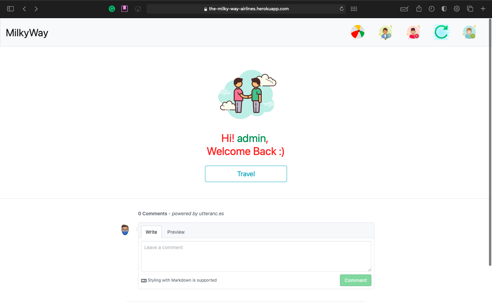
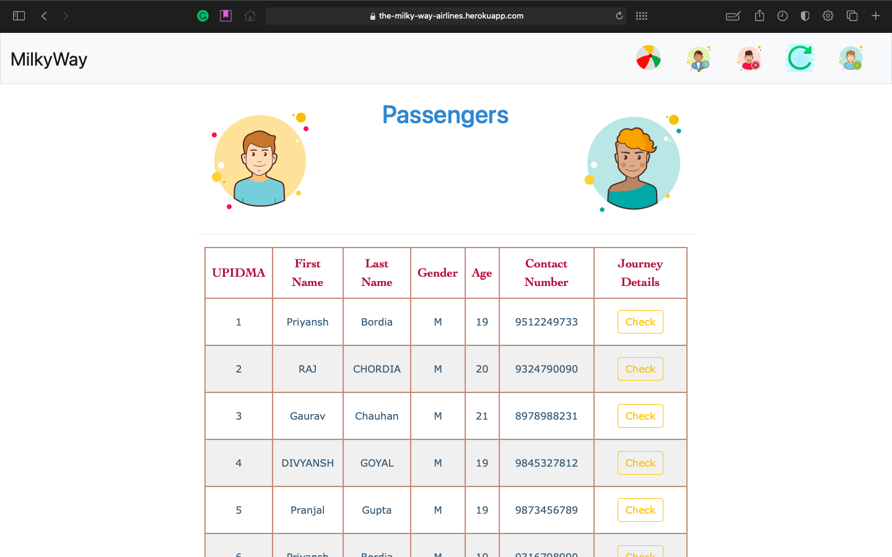

# [The MilkyWay Airlines](https://priyanshbordia.github.io/The-MilkyWay-Airlines)

[](https://travis-ci.com/PriyanshBordia/The-MilkyWay-Airlines)
[](https://github.com/PriyanshBordia/The-MilkyWay-Airlines/issues)
[](https://github.com/PriyanshBordia/The-MilkyWay-Airlines/network)
[](https://github.com/PriyanshBordia/The-MilkyWay-Airlines/stargazers)
[](https://the-milkyway-airlines.readthedocs.io/en/latest/?badge=latest)
[](https://github.com/PriyanshBordia/The-MilkyWay-Airlines/blob/main/LICENSE)

### Fasten Your seatbelts we willl take you on a journey you never went before.!


> You can book tickets [here](https://the-milky-way-airlines.herokuapp.com).<br>
> Find the site [here](https://the-milkway-airlines.business.site/?m=true).<br>
> If any suggestions please create a new issue using feature template.

#### To run app on local machine:
```bash
$ git clone https://github.com/PriyanshBordia/The-MilkyWay-Airlines.git
$ python3 -m venv venv
$ source venv/bin/activate
$ cd The-MilkyWay-Airlines
$ pip install -r requirements.txt
$ sh run.sh 1
```

### `Registeration Page`:


### `Login Page`:


### `Booking Page`:



### `Travel Page`:


### `Flights Details`:


### `Flights Page`:


### `Users Details`:


### `Users Page`:


### `Passengers Details`:


### `Passengers Page`:



### `Reset Password`:


### `E -mail Sent Success`:


