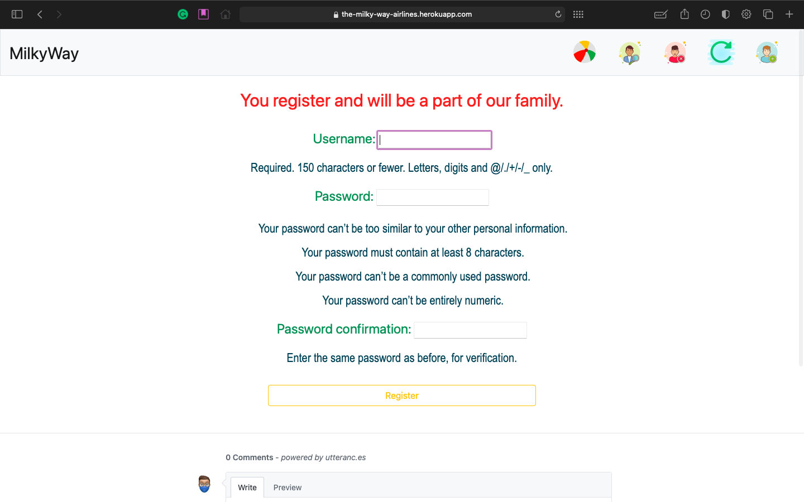
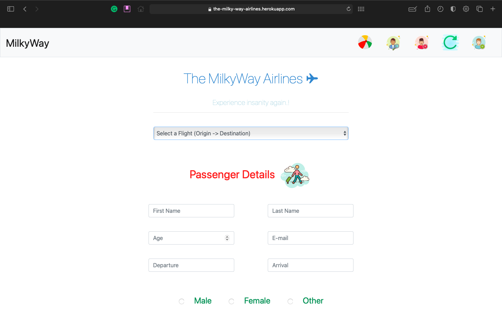

=====================
The MilkyWay Airlines
=====================

"""""""""""""""""""""""""""
Experience insanity again.!
"""""""""""""""""""""""""""

.. contents:: Overview
   :depth: 2

Introduction
------------
   - ``The MilkyWay Airlines`` is a light weight ``Django`` project where you can login and book flight tickets for different destinations.
   - ``HTML5`` ``CSS3`` ``SASS`` were used for styling and JavaScript was used for client side rendering.
   - ``postgresql`` was used to store data and the app was deployed on ``heroku``.

------------
Installation
------------
   - First make sure you have Python 3.8 or higher installed. You can `download`_ ``Python``.

.. _download: https://www.python.org
   :target: _blank

*************************************
To run this project on local machine:
*************************************

.. code-block:: bash

   $ git clone https://github.com/PriyanshBordia/The-MilkyWay-Airlines.git
   $ cd The-MilkyWay-Airlines
   $ pip freeze > requirements.txt
   $ sh run.sh 1

--------
Features
--------
* Register
* Login
* Reset Password
* Edit Details
* Add Passenger
* Book Flight
* View Flights
* View User
* View Users
* View Passenger
* View Passengers

--------
Snippets
--------

.. image:: ../../screenshots/login.png

.. image:: ../../screenshots/travel2.png
.. image:: ../../screenshots/flight.png
.. image:: ../../screenshots/flights.png

.. image:: ../../screenshots/users.png

.. image:: ../../screenshots/passengers.png

------------------
About Contributors
------------------
Hi.! there my name is Priyansh Bordia and I am an CSE UnderGrad at LNMIIT, Jaipur, India. I enjoy working on project that help me get more experience of different technologies and fields. I play football.

* Link to personal website is `website`_.
* Link to github account is `github`_.

.. _website: https://priyanshbordia.github.io

.. _github: https://github.com/PriyanshBordia
